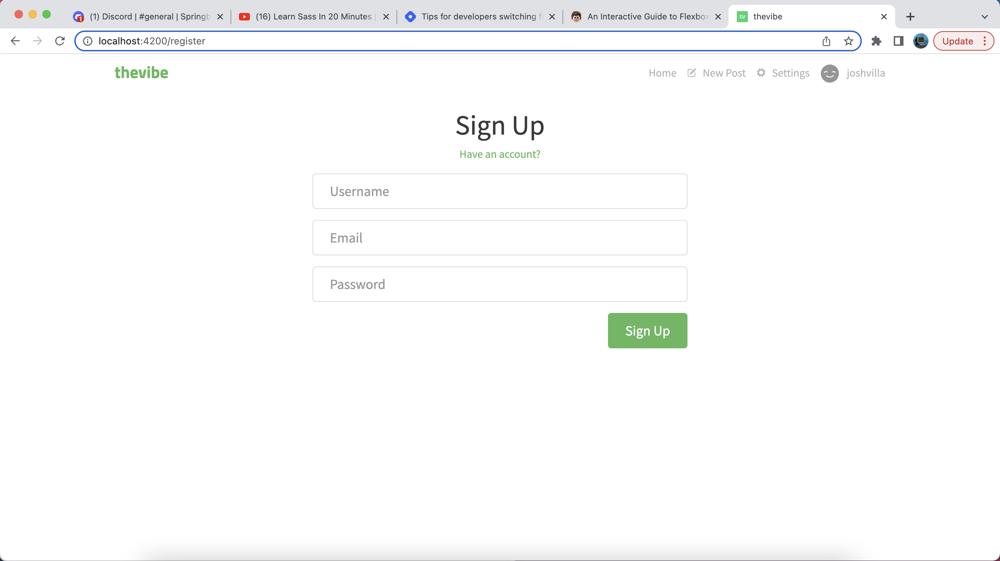
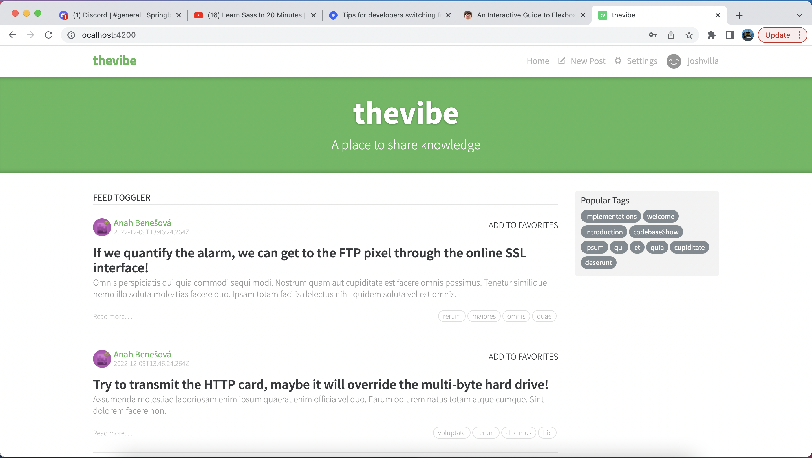
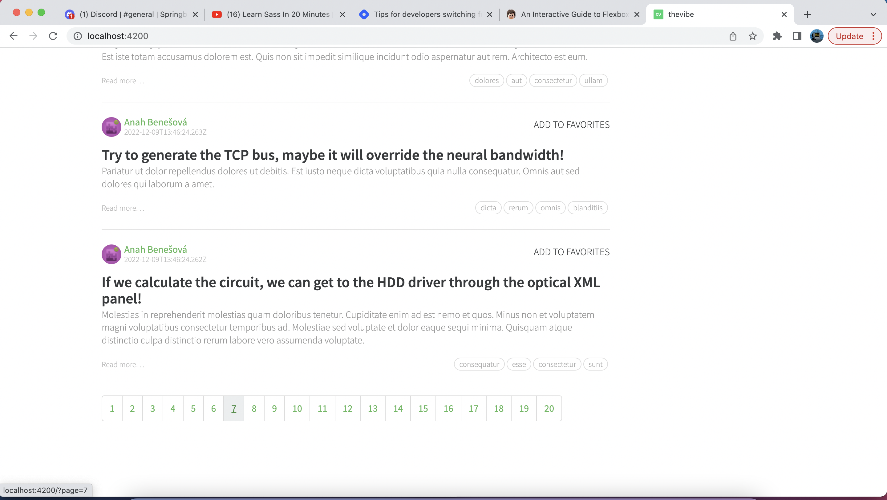

# thevibe
A Medium clone

## Overview

thevibe is a website application built using the Angular framework, and is a take/clone of the popular website Medium. The Medium website is a resource I constantly found myself using for knowledge and tech related articles to further expand my knowledge in the tech/engineering field. So I decided to make my own version of it so I can practice my skills in Angular, NgRx, RxJS and Angular Reactive Forms. A user is able to create a new account, login with an existing account, and able to create/edit/delete articles from their feed. A user can also edit their profile, favorite other articles, and add friends. The Realworld.io api was used for this project and the documentation can be found here: https://realworld-docs.netlify.app/docs/implementation-creation/introduction. This project is an ongoing project that I will work on to further develop my skills and implement new features I learn. 

### Live Site

TODO

## Screen Shots

### Built with

- Semantic HTML5 markup
- CSS custom properties
- Angular
- Typescript
- Bootstrap
- NgRx
- RxJs
- Angular Reactive Forms

### What I learned

I learned so much creating this project. I spent around 50+ hours creating project, and there was not a day where I didn't enjoy what I was doing. A few things I learned was implementing authentication for a user to login, NgRx state management, and how to route to the different components of this web app. There's too many things to name, but I feel a lot more comfortable with Angular but I also know I still have so much to learn!  

### Continued development

If you have any suggestions, please feel free to reach out to me on what improvements I can make. Continuing to learn the ins and outs of Angular, and added some reactive programming concepts. I want to implement to the new features of Angular version15 like the standalone feature to make components independent of an NgModule. 

### Useful resources

- [Boostrap Documentation](https://getbootstrap.com) - Read and used the Bootstrap documentation.
- [StackOverflow](https://www.stackoverflow.com) - Used this resource for a few questions.
- [Angular Documentation](https://angular.io/docs) - Relied on the Angular documentation to build this app.
- [RealWorld API](https://realworld-docs.netlify.app/docs/implementation-creation/introduction) - Relied on the API documentation to build this app.

## Author

- Website - [Josh Villanueva](https://www.linkedin.com/in/patrick-villanueva-/)

